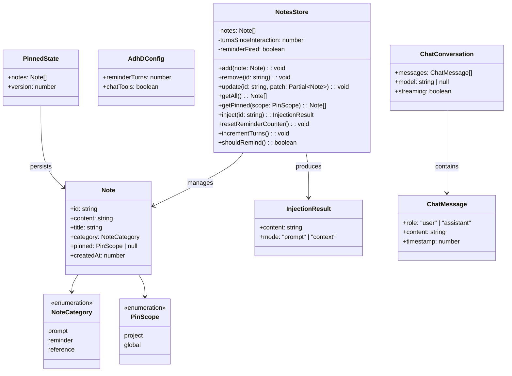

# pi-adhd — Attention Management Extension for Pi

> **Status:** Design complete. Ready for implementation.

## Requirements

- Provide session-scoped "sticky notes" for capturing deferred intents (prompts, reminders, references) without polluting the LLM context window
- Absorb btw (side-chat) functionality into the same package — one extension for all "I thought of something but don't want to derail the main flow" needs
- Publish as a standalone npm package (`pi-adhd`) with zero hard dependencies on other Pi extensions (pi-todo, pi-memory, etc.)
- Offer optional runtime integrations discovered via Pi's EventBus (graceful degradation if absent)
- Provide a clear visual indicator (status bar) that pending notes exist
- Remind the user proactively after N assistant turns that they have pending notes
- Support opt-in persistence ("pinning") for notes that should survive sessions — project-scoped or global
- Surface orphan notes at session shutdown as a best-effort last-chance overlay

### Definition of Done

- `npm install pi-adhd` installs cleanly and loads in Pi without error
- `/note <text>` captures a note via AI classification → preview form → confirm
- `/note` (no args) opens a two-column Notes TUI with vim navigation
- `/btw` opens a side-chat overlay with full btw parity (model picker, read-only tools, streaming, 5 exit actions)
- Side-chat "save as note" exit action: auto-summarize → AI classify → form → confirm
- Status bar shows `🧠 N notes` when notes exist, appends `⚡` after 8+ turns without interaction
- `Ctrl+Shift+N` opens Notes TUI, `Ctrl+Alt+B` opens side-chat
- Notes never enter LLM context (filtered via `context` event)
- Pinned notes persist to `~/.pi/adhd/<org-repo>.json` (project) or `~/.pi/adhd/global.json`
- Pinned notes load at session start with a toast notification
- Session shutdown shows orphan notes overlay (best-effort, non-blocking)
- Extension config via `"pi-adhd"` key in Pi's `settings.json`

## Entities



## Approach

### Strategy

pi-adhd is a published npm package providing two independent UIs unified by shared state and a single status bar indicator:

1. **Notes system:** In-memory note store with categories (prompt/reminder/reference), AI-assisted capture, two-column TUI viewer, opt-in pinning for persistence, turn-count reminders, and session-end orphan surfacing.

2. **Side-chat (btw replacement):** Full btw parity — floating conversation overlay with model picker, read-only tools, streaming responses, and 5 exit actions (discard, inject, summarize+inject, steer, save-as-note).

Both features share one status bar slot and one extension entry point, but have completely separate TUI overlays.

### Key Design Decisions

**Session-scoped by default, opt-in persistence:**
Notes are ephemeral (in-memory). The user explicitly "pins" a note to persist it to disk. This matches the sticky-note metaphor — temporary by nature, with the option to make permanent.

**Notes never enter LLM context:**
The agent is unaware of notes. They're purely for the human's attention management. Injection is always a deliberate user action from the TUI.

**AI classification on capture (BAML optional):**
When adding a note via `/note <text>`, AI classifies the category and cleans up the title. Uses pi-baml if present (tier 1), direct LLM call (tier 2), or heuristic fallback (tier 3). No hard dependency on pi-baml.

**Separate TUIs, not tabbed:**
Notes and chat are independent overlays. No mega-TUI with tabs. Each is focused and simple. The unifying element is the package and status bar, not the UI.

**btw absorbed, not migrated:**
pi-adhd reimplements side-chat functionality purpose-built for this package. The standalone btw extension is deprecated. All `/btw` commands and `Ctrl+Alt+B` shortcut transfer to pi-adhd.

**Queue-based injection removed:**
No "inject all" feature. Users inject one note at a time via `Enter` in the TUI. Keeps complexity low and user in control.

### Alternatives Rejected

- **Tabbed mega-TUI:** Rejected — over-couples features that have different interaction patterns (static notes vs conversational chat). Each UI is simpler standalone.
- **Notes visible to LLM:** Rejected — creates unwanted agent behavior (agent commenting on notes, creating notes proactively). Notes are human-only.
- **Keyword heuristic for session-end detection:** Rejected — too fragile ("that's all I know about X" false positives). Use `session_shutdown` event instead.
- **Per-note reminder thresholds:** Rejected — overengineered. Global threshold is sufficient for v1.
- **Multiple commands (`/reminder`, `/ref`):** Rejected — single `/note` command with AI classification handles all categories.
- **Cancellable session shutdown:** Rejected — Pi doesn't support it. Best-effort overlay during shutdown is sufficient.

## Structure

```
pi-adhd/                              ← npm package root
├── package.json                      ← pi manifest, extension + skills declaration
├── tsconfig.json                     ← strict ESM
├── tsup.config.ts                    ← ESM bundler
├── vitest.config.ts                  ← unit tests
├── eslint.config.js                  ← ESLint 9 flat config
├── src/
│   ├── index.ts                      ← Extension factory, event registration, commands
│   ├── config.ts                     ← parseAdhDConfig(settings) → AdhDConfig
│   ├── notes/
│   │   ├── model.ts                  ← Note type, NoteCategory, PinScope, InjectionResult
│   │   ├── store.ts                  ← NotesStore class (in-memory CRUD + reminder logic)
│   │   ├── capture.ts               ← AI classification (BAML tier 1, LLM tier 2, heuristic tier 3)
│   │   ├── persistence.ts           ← Pin load/save (project + global JSON files)
│   │   ├── tui.ts                   ← Two-column Notes TUI overlay
│   │   └── form.ts                  ← Note preview/edit form (shared with capture + btw save)
│   ├── chat/
│   │   ├── engine.ts                ← LLM conversation engine (model calls, streaming)
│   │   ├── tools.ts                 ← Read-only tools (read, grep, ls, find)
│   │   ├── tui.ts                   ← Chat overlay UI (editor, messages, exit menu)
│   │   └── actions.ts               ← Exit actions (discard, inject, summarize, steer, save-as-note)
│   └── reminders/
│       ├── tracker.ts               ← Turn counter, shouldRemind(), reset logic
│       └── shutdown.ts              ← Session-end orphan overlay
├── skills/                           ← (empty for now, future: adhd skill for users)
├── tests/
│   ├── unit/
│   │   ├── store.test.ts            ← NotesStore CRUD, reminder logic
│   │   ├── capture.test.ts          ← Classification tiers, fallback
│   │   ├── persistence.test.ts      ← Pin save/load, repo slug
│   │   ├── tracker.test.ts          ← Turn counting, threshold, reset
│   │   ├── config.test.ts           ← Settings parsing
│   │   └── actions.test.ts          ← Exit action logic
│   └── integration/
│       └── tui.test.ts              ← TUI render/interaction tests (if feasible)
├── AGENTS.md                         ← Project guide for AI agents
├── LICENSE                           ← MIT
└── README.md                         ← Usage, configuration, features
```

### Dependency Graph

```
src/index.ts (extension factory)
├── src/config.ts (parseAdhDConfig)
├── src/notes/store.ts (NotesStore)
│   └── src/notes/model.ts (types)
├── src/notes/capture.ts (classifyNote)
│   └── src/notes/model.ts (types)
├── src/notes/persistence.ts (loadPinned, savePinned)
│   └── src/notes/model.ts (types)
├── src/notes/tui.ts (createNotesTUI)
│   ├── src/notes/store.ts (NotesStore)
│   └── src/notes/form.ts (createNoteForm)
├── src/chat/tui.ts (createChatTUI)
│   ├── src/chat/engine.ts (ChatEngine)
│   ├── src/chat/tools.ts (readOnlyTools)
│   └── src/chat/actions.ts (exitActions)
├── src/reminders/tracker.ts (ReminderTracker)
└── src/reminders/shutdown.ts (createShutdownOverlay)
```

### Integration Points with Pi

| Pi API | Usage |
|--------|-------|
| `pi.on("session_start")` | Load pinned notes, show toast, init reminder tracker |
| `pi.on("turn_end")` | Increment turn counter, check reminder threshold |
| `pi.on("session_shutdown")` | Show orphan notes overlay (best-effort) |
| `pi.on("context")` | Filter note-related custom messages from LLM context |
| `pi.events.on("pi-baml:ready")` | Capture BAML library for note classification |
| `ctx.ui.setStatus("pi-adhd", ...)` | Status bar indicator |
| `ctx.ui.notify(...)` | Toast notifications (reminder, session start) |
| `ctx.ui.custom(...)` | Overlay TUIs (notes viewer, chat, forms) |
| `pi.registerCommand("note", ...)` | /note command |
| `pi.registerCommand("btw", ...)` | /btw command |
| `pi.registerShortcut(...)` | Ctrl+Shift+N (notes), Ctrl+Alt+B (chat) |
| `pi.sendMessage(...)` | Custom messages (display-only, context-filtered) |
| `pi.sendUserMessage(...)` | Note injection as user message (prompt category) |
| `ctx.modelRegistry` | Resolve model + API keys for chat and classification |

## Operations

### 1. Project scaffolding
**Files:** `package.json`, `tsconfig.json`, `tsup.config.ts`, `vitest.config.ts`, `eslint.config.js`, `.gitignore`, `LICENSE`, `AGENTS.md`
- npm package `pi-adhd` with `pi` manifest: `{ extensions: ["dist/index.js"] }`
- Dev dep: `@earendil-works/pi-coding-agent` (types only)
- Dev deps: typescript, tsup, vitest, eslint, @typescript-eslint
- No runtime dependencies beyond Pi's built-in APIs
- ESM-only, Node 20+, strict TypeScript

### 2. Types and model
**File:** `src/notes/model.ts`
- `NoteCategory` = "prompt" | "reminder" | "reference"
- `PinScope` = "project" | "global"
- `Note` interface: id (nanoid), content, title, category, pinned (PinScope | null), createdAt
- `InjectionResult`: content string + mode ("prompt" triggers turn, "context" is passive)
- Category → icon mapping: prompt→🚀, reminder→🔔, reference→📎
- Category → injection mode mapping: prompt→"prompt", reference→"context", reminder→null (never injected)

### 3. Config parsing
**File:** `src/config.ts`
- `parseAdhDConfig(settings: unknown) → AdhDConfig`
- Reads `"pi-adhd"` key from settings object
- Defaults: `{ reminderTurns: 8, chatTools: true }`
- Validates: reminderTurns is positive number, chatTools is boolean
- Missing key → all defaults (not an error)

### 4. Notes store (in-memory)
**File:** `src/notes/store.ts`
- `NotesStore` class: notes array, turnsSinceInteraction counter, reminderFired flag
- `add(note)`: push to array
- `remove(id)`: filter out by id
- `update(id, patch)`: merge patch into matching note
- `getAll()`: return all notes (session + loaded pins)
- `inject(id)`: removes note, returns InjectionResult based on category. Reminder category → throws (cannot inject reminders)
- `incrementTurns()`: bumps counter, resets reminderFired if threshold crossed again
- `shouldRemind(threshold)`: returns true if turnsSinceInteraction >= threshold AND !reminderFired
- `resetReminderCounter()`: sets turnsSinceInteraction = 0, reminderFired = false
- `loadPinned(notes)`: merge pinned notes into store (called at session start)
- `count`: getter for total note count

### 5. Note persistence (pinning)
**File:** `src/notes/persistence.ts`
- Storage root: `~/.pi/adhd/`
- `PinnedState`: `{ notes: Note[], version: 1 }`
- `resolveRepoSlug(pi)`: same pattern as pi-todo (git remote → org-repo slug, fallback to dir name)
- `loadPinned(repoSlug)`: reads `~/.pi/adhd/<slug>.json` + `~/.pi/adhd/global.json`, merges
- `savePinned(note, scope, repoSlug)`: appends note to the appropriate JSON file
- `removePinned(noteId, scope, repoSlug)`: removes note from persisted file
- Creates `~/.pi/adhd/` directory on first pin (mkdir -p equivalent)

### 6. Note capture (AI classification)
**File:** `src/notes/capture.ts`
- `classifyNote(text, options)`: returns `{ title, category, content }`
- Tier 1: BAML (if `options.baml?.available`) — call a classify function
- Tier 2: LLM (if `options.model` available) — direct API call with classification prompt
- Tier 3: Heuristic fallback — title = first 50 chars, category = "prompt" (default)
- Classification prompt: "Classify this note as prompt (action to take), reminder (don't forget), or reference (info to remember). Extract a concise title."

### 7. Note preview form
**File:** `src/notes/form.ts`
- `createNoteForm(ctx, classified)`: overlay form with editable fields
- Fields: title, category (cycle on Enter), content (editor on Enter)
- Actions: [Save] [Discard]
- Same pattern as pi-todo's task preview modal
- Returns confirmed Note or null (cancelled)
- Reusable by both `/note <text>` capture flow and btw "save as note" action

### 8. Notes TUI (two-column viewer)
**File:** `src/notes/tui.ts`
- `createNotesTUI(ctx, store, callbacks)`: overlay with two-column layout
- Left column: note list with category icon prefix, 📌 for pinned, ▸ cursor
- Right column: full content of selected note
- Keybindings: j/k navigate, Enter inject, e edit, c cycle category, d delete, p pin project, P pin global, Esc/q close
- After inject: remove note from store, update status bar, close TUI if empty
- After pin: update note's pinned field, save to disk, update icon
- Calls `store.resetReminderCounter()` on open (acknowledges reminder)

### 9. Chat engine
**File:** `src/chat/engine.ts`
- `ChatEngine` class: manages conversation messages, model selection, streaming state
- `send(userMessage, signal)`: appends user message, calls model, streams response, appends assistant message
- `setModel(model)`: switches model for subsequent calls
- `getMessages()`: returns full conversation history
- `summarize(signal)`: calls model with "summarize this conversation concisely" prompt, returns summary string
- Uses `ctx.modelRegistry` for API key resolution
- Streaming via Pi's `stream()` utility

### 10. Chat read-only tools
**File:** `src/chat/tools.ts`
- `createReadOnlyTools(pi)`: returns tool definitions for read, grep, ls, find
- Same tools as current btw — allows the side-chat to explore the codebase
- Gated by `config.chatTools` — if false, returns empty array (simple chat mode)

### 11. Chat exit actions
**File:** `src/chat/actions.ts`
- 5 actions: discard, inject, summarize+inject, steer, save-as-note
- `discard`: returns null (conversation thrown away)
- `inject`: returns `{ action: "inject", content: fullConversation }`
- `summarize+inject`: calls engine.summarize(), returns `{ action: "inject", content: summary }`
- `steer`: returns `{ action: "steer", content: lastAssistantMessage }`
- `save-as-note`: calls engine.summarize(), then triggers note capture flow (classifyNote → form)
- Each action returns an `ExitResult` that the caller (index.ts) handles

### 12. Chat TUI
**File:** `src/chat/tui.ts`
- `createChatTUI(ctx, config, callbacks)`: floating overlay
- Scrollable message history with markdown rendering
- Editor at bottom for user input
- Model picker (Ctrl+L)
- Exit menu (Esc when not streaming)
- 5 exit actions displayed in exit menu
- Streaming indicator during model responses
- Notification when main agent finishes while overlay is open
- Same UX as current btw — users shouldn't notice the switch

### 13. Reminder tracker
**File:** `src/reminders/tracker.ts`
- `ReminderTracker` class: wraps turn counting logic
- `onTurnEnd(store, config, ctx)`: increments store turns, checks shouldRemind, fires toast + updates status
- `updateStatus(store, ctx)`: renders status bar string with optional ⚡
- Status format: `🧠 N notes` or `🧠 N notes ⚡` (when reminder active)
- After firing: sets reminderFired = true (won't re-fire until reset)

### 14. Shutdown overlay
**File:** `src/reminders/shutdown.ts`
- `createShutdownOverlay(ctx, store)`: shows overlay listing orphan notes
- Orphan = any note that hasn't been injected or pinned
- For each note: show title, category icon, content preview
- Actions per note: [Pin Project] [Pin Global] [Dismiss]
- Global action: [Dismiss All]
- Best-effort: runs during `session_shutdown`. If Pi exits before user acts, notes are lost (expected).

### 15. Extension entry point
**File:** `src/index.ts`
- Default export: `piAdhd(pi: ExtensionAPI)` factory function
- Reads config via `parseAdhDConfig(pi.settings)`
- Creates `NotesStore` instance (in-memory)
- Captures BAML via `pi.events.on("pi-baml:ready")`
- Registers `/note` command (no args → TUI, with args → capture flow)
- Registers `/btw` command (no args → blank chat, with args → pre-filled)
- Registers `Ctrl+Shift+N` shortcut (notes TUI)
- Registers `Ctrl+Alt+B` shortcut (chat TUI)
- On `session_start`: load pinned notes, show toast if any, init status bar
- On `turn_end`: call reminderTracker.onTurnEnd()
- On `session_shutdown`: call createShutdownOverlay() if orphan notes exist
- On `context`: filter custom messages with `pi-adhd-*` prefix
- Registers message renderer for `pi-adhd-notification` type

### 16. Tests
**Files:** `tests/unit/`
- `store.test.ts`: NotesStore CRUD, inject behavior per category, reminder logic, pinned loading
- `capture.test.ts`: classification tiers, BAML present/absent, heuristic fallback
- `persistence.test.ts`: save/load JSON, repo slug resolution, mkdir behavior
- `tracker.test.ts`: turn counting, threshold check, reset, status string generation
- `config.test.ts`: defaults, overrides, validation
- `actions.test.ts`: each exit action returns correct ExitResult shape

## Norms

- Follow pi-baml's package structure and conventions (package.json `pi` field, ESM, tsup, vitest)
- Follow `coding-discipline` skill principles (single responsibility, minimal interface, early return)
- Pure functions where possible; side effects only in extension factory and event handlers
- Use Pi's TUI primitives: `Text`, `Key`, `matchesKey`, `Editor`, `BorderedLoader`
- Same overlay pattern as pi-todo's modals: `ctx.ui.custom()` with `overlay: true`
- Status bar updates are synchronous and immediate after state changes
- No `any` types — TypeScript strict mode
- JSDoc on all exported functions
- ESM only, no CommonJS
- File naming: kebab-case
- ID generation: use `crypto.randomUUID()` or timestamp-based (no external deps)

## Safeguards

- **MUST NOT** hard-depend on pi-baml, pi-todo, or pi-memory. All integrations are runtime-discovered via EventBus. Extension works fully without them.
- **MUST NOT** inject notes into LLM context. Notes are filtered from context via the `context` event hook. Only explicit user action (Enter in TUI) injects.
- **MUST NOT** persist session notes without explicit user "pin" action. Default is in-memory only.
- **MUST** handle missing `~/.pi/adhd/` directory gracefully (create on first pin, empty array on load if not found).
- **MUST** show preview form before saving any note (no silent captures). User always confirms.
- **MUST** auto-delete notes after injection (no stale "already injected" notes cluttering the list).
- **MUST** reset reminder counter when user opens Notes TUI (acknowledges pending notes).
- **MUST** degrade gracefully if `ctx.hasUI` is false (headless mode — commands notify error, no overlays).
- **MUST** use `prompt` as default category when AI classification fails or is unavailable.
- **MUST NOT** block session shutdown — the orphan overlay is best-effort. If Pi exits, notes are lost (acceptable for session-scoped data).
- **MUST** keep btw feature parity — users switching from standalone btw should notice no regression.
- **OUT OF SCOPE for V1:** Agent-facing tools (notes never exposed to LLM), tabbed TUI, inject-all queuing, per-note reminder thresholds, keyword heuristic session-end detection, cancellable shutdown.
